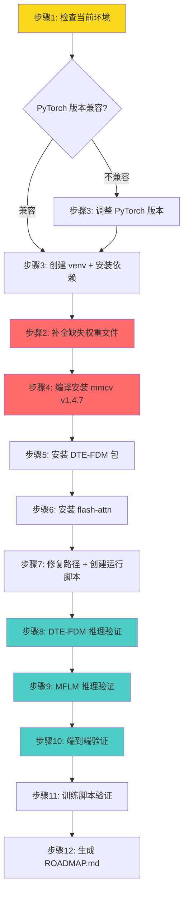

# FakeShield 环境搭建与运行计划

## 项目概述

FakeShield 是一个可解释的图像伪造检测与定位（IFDL）多模态框架，包含三个核心组件：

- **DTE-FDM**（Domain Tag-guided Explainable Forgery Detection Module）：基于 LLaVA-v1.5-13b 的篡改检测与解释模块，需要 `transformers==4.37.2`
- **MFLM**（Multimodal Forgery Localization Module）：基于 GLaMM-GranD + SAM 的篡改区域定位模块，需要 `transformers==4.28.0`
- **DTG**（Domain Tag Generator）：基于 ResNet-50 的域标签分类器（3类：AIGC/DeepFake/Photoshop）

两模块构成串行流水线：DTG 分类 → DTE-FDM 输出 JSONL → MFLM 读取并生成篡改 mask。

---

## 关键问题诊断

### 问题1：FakeShield/weight/ 下模型文件不完整 ⚠️ 严重

| 位置 | DTE-FDM 文件 | MFLM 文件 |
|------|-------------|----------|
| `weight/fakeshield-v1-22b/DTE-FDM/` | 6个safetensors分片 ✅ 完整 | 2个bin分片 ✅ 完整 |
| `FakeShield/weight/fakeshield-v1-22b/DTE-FDM/` | 缺 `model-00004-of-00006.safetensors` | 缺 `pytorch_model-00001-of-00002.bin` |

**所有脚本都相对于 `FakeShield/` 目录运行，引用 `./weight/fakeshield-v1-22b`**，所以必须确保 `FakeShield/weight/` 下文件完整。

**解决方案**：从项目根目录 `weight/` 复制缺失文件到 `FakeShield/weight/`。

### 问题2：SAM 预训练权重 ✅ 已解决

`FakeShield/weight/sam_vit_h_4b8939.pth` 已存在。

### 问题3：transformers 版本冲突

DTE-FDM 需要 `transformers==4.37.2`，MFLM 需要 `transformers==4.28.0`。官方脚本通过中途 `pip install` 切换版本。由于两模块是串行流水线（不同 Python 进程），在同一环境中切换版本是可行的，但需注意：

- 切换版本可能破坏其他依赖的兼容性
- 后续如果需要同时运行两个模块的服务，需要双 venv 方案

### 问题4：图片路径不一致

- 脚本引用 `./playground/image/Sp_D_CRN_A_ani0043_ani0041_0373.jpg`
- 实际目录是 `./playground/images/`，且该示例图片不存在
- 现有图片：`Sp_D_CND_A_pla0005_pla0023_0281.jpg`、`Sp_D_CND_A_sec0056_sec0015_0282.jpg`、`Sp_D_CNN_A_ani0049_ani0084_0266.jpg`、`Sp_D_CNN_A_ani0053_ani0054_0267.jpg`

### 问题5：PyTorch 版本兼容性

- README 要求：PyTorch 1.13.0 + CUDA 11.6
- DTE-FDM pyproject.toml 要求：torch==1.13.0
- 当前 requirements.txt 末尾有：torch==2.7.1 + cu118
- mmcv v1.4.7 和 flash-attn 对 PyTorch/CUDA 版本敏感

**需要先检查当前环境的实际 PyTorch/CUDA 版本，再决定是否需要降级或调整。**

---

## 执行步骤

### 步骤1：检查当前环境

```bash
# 检查 Python 版本
python3 --version

# 检查 PyTorch 和 CUDA
python3 -c "import torch; print(f'PyTorch: {torch.__version__}'); print(f'CUDA available: {torch.cuda.is_available()}'); print(f'GPU count: {torch.cuda.device_count()}'); print(f'GPU name: {torch.cuda.get_device_name(0)}')"

# 检查 NVIDIA 驱动和 CUDA 版本
nvidia-smi

# 检查已安装的关键包
pip list | grep -E "torch|transformers|mmcv|flash-attn|deepspeed"
```

根据检查结果决定后续环境配置策略。

### 步骤2：补全 FakeShield/weight/ 下缺失的模型文件

```bash
# 从项目根目录 weight/ 复制缺失文件到 FakeShield/weight/
# DTE-FDM: 补 model-00004-of-00006.safetensors
cp weight/fakeshield-v1-22b/DTE-FDM/model-00004-of-00006.safetensors FakeShield/weight/fakeshield-v1-22b/DTE-FDM/

# MFLM: 补 pytorch_model-00001-of-00002.bin
cp weight/fakeshield-v1-22b/MFLM/pytorch_model-00001-of-00002.bin FakeShield/weight/fakeshield-v1-22b/MFLM/

# 验证完整性
ls -la FakeShield/weight/fakeshield-v1-22b/DTE-FDM/*.safetensors | wc -l  # 应为 6
ls -la FakeShield/weight/fakeshield-v1-22b/MFLM/*.bin | wc -l              # 应为 2
ls -la FakeShield/weight/fakeshield-v1-22b/DTG.pth                         # 应存在
ls -la FakeShield/weight/sam_vit_h_4b8939.pth                              # 应存在
```

### 步骤3：配置 Python 虚拟环境

根据步骤1的环境检查结果，有两种策略：

**策略A：如果当前环境 PyTorch 版本兼容（torch 1.13.x + cu116）**
```bash
cd FakeShield
python3 -m venv venv
source venv/bin/activate
pip install -r requirements.txt -i https://pypi.tuna.tsinghua.edu.cn/simple
```

**策略B：如果当前环境 PyTorch 版本较新（torch 2.x + cu118）**
需要评估兼容性。mmcv v1.4.7 可能不兼容 torch 2.x，需要：
- 尝试安装 mmcv-full 预编译包匹配当前 torch 版本
- 或降级到 torch 1.13.0（但需确保 CUDA 驱动兼容）

**推荐**：先检查环境，再决定策略。考虑到用户说"依赖大概都装好了"，可能已有可用的环境。

### 步骤4：编译安装 mmcv v1.4.7

```bash
cd FakeShield/mmcv
git checkout v1.4.7
MMCV_WITH_OPS=1 pip install -e . -i https://pypi.tuna.tsinghua.edu.cn/simple

# 验证
python3 -c "import mmcv; print(mmcv.__version__)"
```

如果源码编译失败，使用预编译包（需匹配当前 torch+cuda 版本）：
```bash
# 示例：torch 1.13 + cu116
pip install mmcv-full==1.4.7 -f https://download.openmmlab.com/mmcv/dist/cu116/torch1.13.0/index.html
# 示例：torch 2.x + cu118（可能无对应预编译包，需源码编译或升级 mmcv 版本）
```

### 步骤5：安装 DTE-FDM 包

```bash
cd FakeShield/DTE-FDM
pip install -e . -i https://pypi.tuna.tsinghua.edu.cn/simple
pip install -e ".[train]" -i https://pypi.tuna.tsinghua.edu.cn/simple
```

### 步骤6：安装 flash-attn

```bash
pip install flash-attn --no-build-isolation -i https://pypi.tuna.tsinghua.edu.cn/simple
```

注意：flash-attn 需要编译，确保 ninja 和 CUDA toolkit 可用。

### 步骤7：修复已知问题

**7a. 修复图片路径**

```bash
cd FakeShield
# 创建脚本期望的 image 目录并复制现有测试图片
mkdir -p playground/image
cp playground/images/*.jpg playground/image/
```

**7b. 创建统一运行脚本 `run_pipeline.sh`**

由于 transformers 版本冲突，创建分步执行脚本：

```bash
#!/bin/bash
set -e

WEIGHT_PATH=./weight/fakeshield-v1-22b
IMAGE_PATH=./playground/image/Sp_D_CND_A_pla0005_pla0023_0281.jpg
DTE_FDM_OUTPUT=./playground/DTE-FDM_output.jsonl
MFLM_OUTPUT=./playground/MFLM_output

echo "======== Stage 1: DTE-FDM (transformers==4.37.2) ========"
pip install -q transformers==4.37.2
CUDA_VISIBLE_DEVICES=0 \
python -m llava.serve.cli \
    --model-path ${WEIGHT_PATH}/DTE-FDM \
    --DTG-path ${WEIGHT_PATH}/DTG.pth \
    --image-path ${IMAGE_PATH} \
    --output-path ${DTE_FDM_OUTPUT}

echo "======== Stage 2: MFLM (transformers==4.28.0) ========"
pip install -q transformers==4.28.0
CUDA_VISIBLE_DEVICES=0 \
python ./MFLM/cli_demo.py \
    --version ${WEIGHT_PATH}/MFLM \
    --DTE-FDM-output ${DTE_FDM_OUTPUT} \
    --MFLM-output ${MFLM_OUTPUT}

echo "======== Pipeline Complete ========"
```

### 步骤8：运行 DTE-FDM 推理验证

```bash
cd FakeShield
pip install transformers==4.37.2
CUDA_VISIBLE_DEVICES=0 python -m llava.serve.cli \
    --model-path ./weight/fakeshield-v1-22b/DTE-FDM \
    --DTG-path ./weight/fakeshield-v1-22b/DTG.pth \
    --image-path ./playground/image/Sp_D_CND_A_pla0005_pla0023_0281.jpg \
    --output-path ./playground/DTE-FDM_output.jsonl
```

预期输出：JSONL 文件包含图片路径、DTG 域标签分类结果、DTE-FDM 的篡改检测解释文本。

### 步骤9：运行 MFLM 推理验证

```bash
cd FakeShield
pip install transformers==4.28.0
CUDA_VISIBLE_DEVICES=0 python ./MFLM/cli_demo.py \
    --version ./weight/fakeshield-v1-22b/MFLM \
    --DTE-FDM-output ./playground/DTE-FDM_output.jsonl \
    --MFLM-output ./playground/MFLM_output
```

预期输出：`MFLM_output/` 目录下生成篡改区域的 mask 图片。

### 步骤10：端到端流水线验证

确认完整输出：
- DTE-FDM 输出包含正确的篡改检测描述
- MFLM 输出包含正确的篡改区域 mask
- mask 与原始图片尺寸匹配
- 对于真实图片，DTE-FDM 应输出 "has not been tampered with"，MFLM 不再执行

### 步骤11：确认训练脚本可用性

验证 LoRA finetune 配置适配 4卡 A100：

**DTE-FDM 训练** (`scripts/DTE-FDM/finetune_lora.sh`)：
- 使用 `deepspeed --include localhost:0,1,2,3` → 4卡并行 ✅
- `per_device_train_batch_size 6` → 总 batch = 24
- 需要 `transformers==4.37.2`
- 需要训练数据 `DATA_PATH`（后续准备）

**MFLM 训练** (`scripts/MFLM/finetune_lora.sh`)：
- 使用 `deepspeed --include localhost:0,1,2,3` → 4卡并行 ✅
- `batch_size 6` → 总 batch = 24
- 需要 `transformers==4.28.0`
- 需要 `sam_vit_h_4b8939.pth` ✅
- 需要训练数据 `DATA_PATH=./dataset`（后续准备）

当前只需确认脚本语法正确、依赖齐全，不实际执行训练。

### 步骤12：生成 ROADMAP.md

在 `FakeShield/ROADMAP.md` 中记录整个搭建过程、遇到的问题和解决方案。

---

## 流程图



---

## 风险与注意事项

1. **mmcv 编译风险**: mmcv v1.4.7 源码编译对 CUDA/PyTorch 版本非常敏感。如果当前环境不是 PyTorch 1.13 + CUDA 11.6，编译可能失败。备选方案是使用预编译 wheel 或升级 mmcv 版本。
2. **flash-attn 编译风险**: 需要 CUDA toolkit 和 ninja。A100 支持 flash-attn，但编译环境需正确配置。
3. **transformers 版本切换**: pip 切换版本在同一 Python 环境中是破坏性操作。推理阶段可接受（串行执行），但后续如果需要同时服务两个模块，必须使用双 venv 方案。
4. **GPU 显存**: DTE-FDM（13b 模型 bf16）约需 ~26GB 显存，MFLM（含 SAM）约需 ~16GB 显存。单卡 A100 80GB 足够运行任一模块推理。训练时 4 卡并行每卡约需 ~40GB。
5. **国内镜像源**: 所有 pip 安装使用 `https://pypi.tuna.tsinghua.edu.cn/simple`，所有 git clone 使用国内镜像。
6. **权重文件一致性**: 确保 `FakeShield/weight/` 和根目录 `weight/` 保持同步，避免加载错误的模型分片。